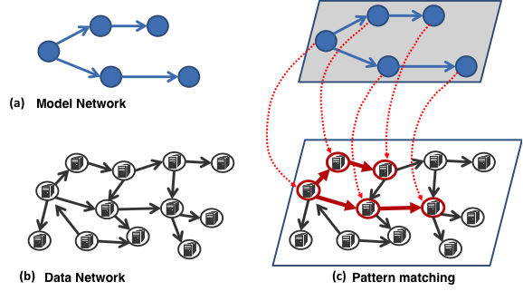
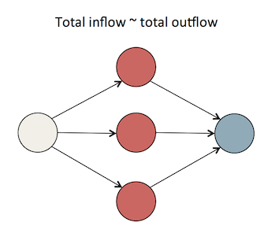

pattern-matching
================

Hadoop MapReduce over Hive based implementation of attributed network pattern matching. 

#Overview



This code performs attributed network pattern matching between a model (or query) graph and a data graph. We generally expect that model graphs are small (~10-100 nodes) while data graphs can be very, very large (millions of nodes, tens-hundreds of millions of edges). While some details of this code are tied to the execution framework (Hive), the processing technique used (MapReduce) and the datasets processed (Bitcoin, Akamai datasets), the core of the code is general and designed to be reusable. 

We are constantly exploring new processing techniques and data frameworks (e.g. BSP w/ Giraph, Spark/GraphX, Titan/Blueprints) and look forward to updating this repository with our findings.

Any query or dataset that can be modeled as an 'attributed network' - nodes and edges with arbitrary attributes, can be processed using these techniques. 

#Algorithm and Processing Techniques

##Map
First, we run a map() function over the Hive input columns of the datasets to extract a mismatch value for the data nodes and edges against the model nodes and edges. This value encodes how well of an individual match each pairing represents. Node mismatches look at things like in/out degrees as well as attributes. Edge mismatches primarily look at attributes. This part of the process scales well with the number of mappers available. 

##Shuffle/Sort
Next, we distribute these mismatch values to our reducers via Hive's DISTRIBUTE and SORT BY operators . For Bitcoin and Akamai we use a time window binning technique. This can be varied depending on the desired query (e.g. X days, weeks, months years). All of the data that falls into the same bin will be processed by that reducer. Other values can be emitted by the map step and used instead of time if desired, for example a clustering/subgraph categorization/other techniques). 

##Reduce
The reducers collect all of the relevant mismatch functions for the nodes and edges sent to their bin. Next, a belief propagation algorithm is run to allow the nodes and edges to exchange information with their neighbors, update their own value, and repeat. This process is similar algorithmically to PageRank and other message passing algorithms. Iteration continues until we converge, after which we can sample the mismatch space to find data nodes that match model nodes with high relevance. This produces the desired result - a mapping for every model node to 1 or more data nodes. By repeating the sampling process we can produce additional results and permutations from the data graph.

#Prerequisites

* Maven
* Java 1.6 or higher

#Building

To build, run the command:

```
mvn clean package 
```

#Datasets

This release targets the ability to run over Hive datasets from XDATA. The two datasets currently supported include the Akamai data and Bitcoin data. Future releases are focusing on documentation and extensibility to support additional datasets by allowing flexible column/dataset specification, updated mismatch functions, and pattern authoring.

#Running

After building run against either dataset by using the appropriate Hive script. Note these currently require access to a Hive system running the X DATA datasets "a_s_test", "bitcoin_inout_edges", or the equivalent. See below on Datasets for additional information.

```
hive -f akamaiDemo.hql
hive -f bitcoinDemo.hql
```

#Output Format
Results are written to an output Hive table: aptima_pm_result. 

The result format for node matches looks like:

|result_num|modelID|dataID|mismatch|dir|
|--:|--:|--:|--:|--:|
|Unique result number, one for each per match|ID of model node in query|ID of matching data node|mismatch value|--|

Mismatch values of a 0.0 represent a perfect match between the model node and data node. 

dir is a special case for Bitcoin and used to denote edge values. This optional information is included to help analyze and verify the results. This additional information is encoded as:

|result_num|modelID|dataID|mismatch|dir|
|--:|--:|--:|--:|--:|
|Unique result number, one for each match|ID of model node in query|Same as model node|Edge value|IN or OUT|

Where IN and OUT represent values seen coming IN or OUT of a given model node. For Bitcoin, this is the Bitcoins transferred on the link.

#Example Patterns

The patterns encoded for the Akamai and Bitcoin demos initially look at a similar attributed graph construct that occurs in both datasets:



For Bitcoin this could represent an instance of a source node distributing Bitcoins to a series of intermediate nodes then recollecting them at a 'sink' node. 

For Akamai this could represent a redundant router configuration where a node is load balancing between several intermediate routers on the way to a destination.

#Datasets

Additional documentation on the input data tables:

## Akamai

Akamai uses a table format like:

|src|dest|region|unixtime|latency
|--:|--:|--:|--:|--:|
|Source IP|Destination IP|Region #|Timestamp|Latency(ms)|

## Bitcoin

Bitcoin uses a table format like:

|id|source_edge_ID|destination_edge_ID|dtg|amount|in_degree|out_degree|node|incoming_amount| outgoing_amount|
|--:|--:|--:|--:|--:|--:|--:|--:|--:|--:|
|Transaction ID|Source Node ID|Destination Node ID|Date time|Bitcoin amount|In degree|Out degree|Node ID|Incoming Bitcoin sum|Outgoing Bitcoin sum|

Where if the row is an edge, source_edge_ID and destination_edge_ID, and amount will be populated and node, in degree, out degree, incoming sum, and outoing sum will be null. If the row is a node, this will be reversed. Date/Time is populated for both types.

# Contact

Feel free to reach out to us at <pattern_matching@aptima.com> 

[www.aptima.com](www.aptima.com)


